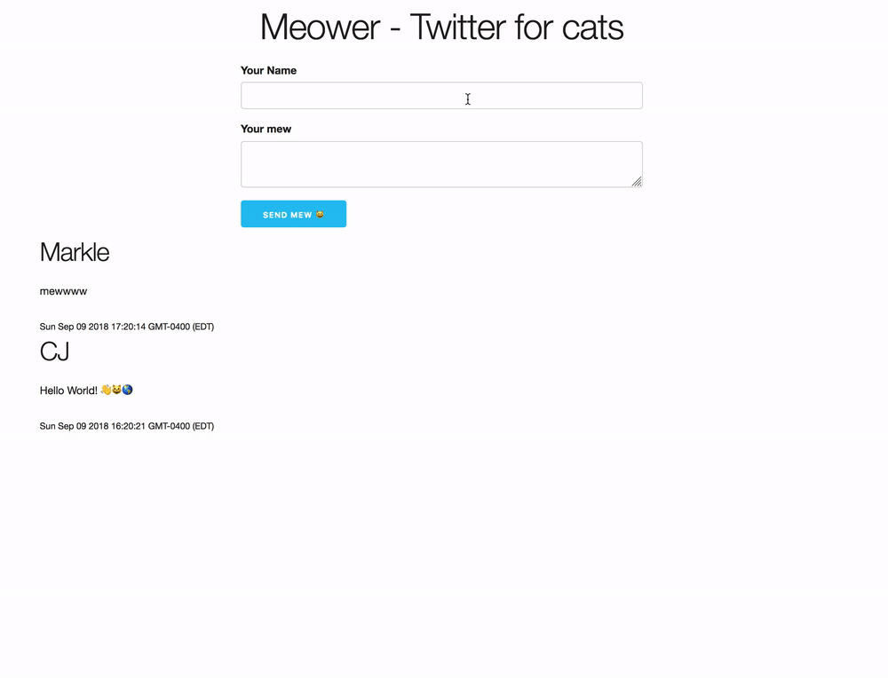

# s23-hack4impact
Spring2023 Hack4Impact Junior Development Team Repository. This repository consist of all 4 projects' complete code. If you want to go along with the workshop, please go to https://github.com/macyso12/s23-hack4impact-JDT to find the most updated version of the workshop to follow-along during the semester.

## FrontEnd Project

### Pinterest Clone w/ HTML, CSS & JavaScript
Build a pinterest clone, with some backend uploading functionality. But mainly focusing on the frontend aspect of the program.

#### Workshop 1
Build the pin component 

#### Workshop 2 
Build the modal component

#### Workshop 3
Build the modal and pin component

#### Workshop 4
Build the final board component

### Youtube Clone w/ ReactJS, Rapid API
Build a youtube clone with components, and calling Rapid API, to get the information to populate your program.

## BackEnd Project

### Twitter Clone w/ NodeJS, MongoDB
Build a twitter clone with components, with a bare bone frontend, and more focus on the backend functionality of posting, and storing data on MongoDB.

Final Project Outcome
